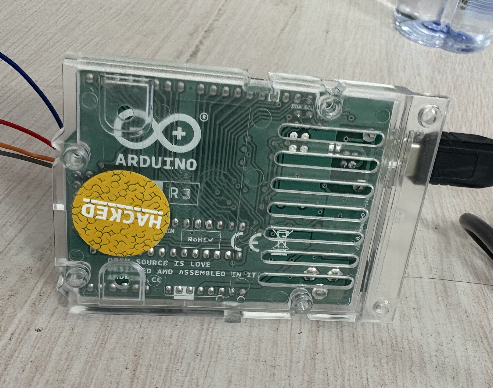
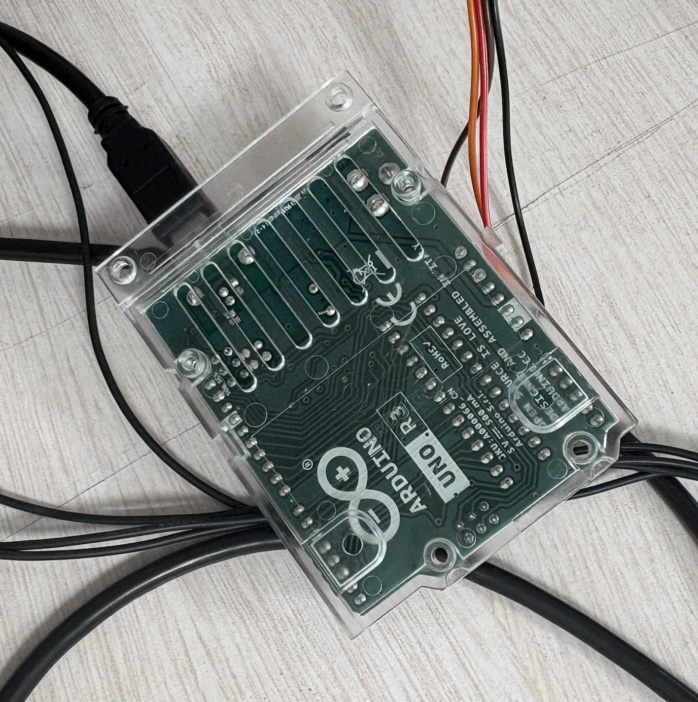
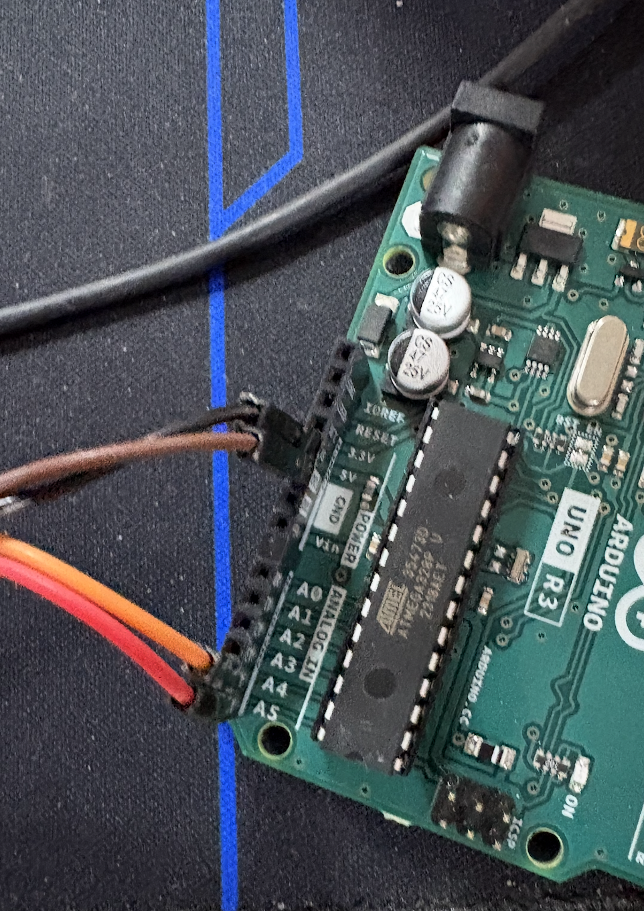
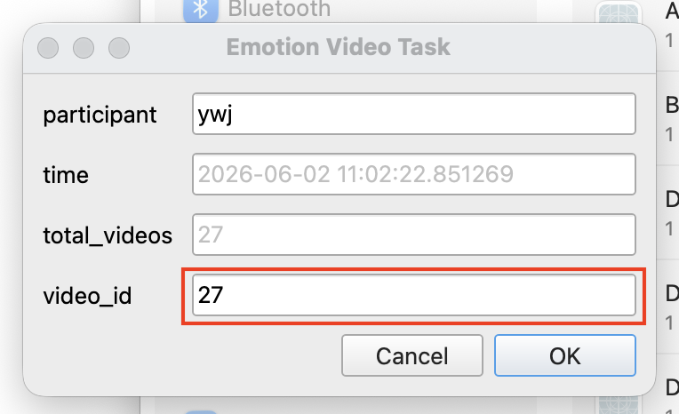

# capstone3

### Step 1
请把视频放到5_stimulation_material下
文件结构应该是：

```
path/to/5_stimulation_materials
├── all_videos_select_1.csv
├── DEAP
│   └── videos
│       ├── Bastard_Set_Of_Dreams.mp4
│       ├── Blame_It_On_The_Boogie.mp4
│       ├── Breathe_Me.mp4
│       ├── Butterfly_Nets.mp4
│       ├── First_Date.mp4
│       ├── First_Day_Of_My_Life.mp4
│       ├── Fuck_You.mp4
│       ├── Goodbye_My_Almost_Lover.mp4
│       ├── Goodbye_My_Lover.mp4
│       ├── How_To_Fight_Loneliness.mp4
│       ├── I_Want_To_Break_Free.mp4
│       ├── I'm_Yours.mp4
│       ├── Jungle_Drum.mp4
│       ├── Love_Shack.mp4
│       ├── Love_Story.mp4
│       ├── Me_Gustas_Tu.mp4
│       ├── Miniature_Birds.mp4
│       ├── Moon_Safari.mp4
│       ├── My_Apocalypse.mp4
│       ├── Normal.mp4
│       ├── Rain.mp4
│       ├── Satisfaction.mp4
│       ├── Say_Hey_(I_Love_You).mp4
│       ├── Scotty_Doesn't_Know.mp4
│       ├── Song_2.mp4
│       ├── The_Beautiful_People.mp4
│       ├── The_One_I_Once_Was.mp4
│       ├── The_Weight_Of_My_Words.mp4
│       └── What_A_Wonderful_World.mp4
├── DECAF
│   └── Videos-DECAF
│       ├── intro_videos
│       │   ├── 1.avi
│       │   └── 2.avi
│       └── Video Stimuli
│           ├── decaf__videos.csv
│           ├── decaf_videos.csv
│           ├── HVHA
│           │   ├── 1.avi
│           │   ├── 2.wmv
│           │   ├── 3.wmv
│           │   ├── 4.avi
│           │   ├── 5.wmv
│           │   ├── 6.wmv
│           │   ├── 7.avi
│           │   ├── 8.avi
│           │   └── 9.avi
│           ├── HVLA
│           │   ├── 10.avi
│           │   ├── 11.avi
│           │   ├── 12.avi
│           │   ├── 13.avi
│           │   ├── 14.avi
│           │   ├── 15.avi
│           │   ├── 16.avi
│           │   ├── 17.avi
│           │   └── 18.avi
│           ├── LVHA
│           │   ├── 28.wmv
│           │   ├── 29.avi
│           │   ├── 30.wmv
│           │   ├── 31.wmv
│           │   ├── 32.avi
│           │   ├── 33.avi
│           │   ├── 34.avi
│           │   ├── 35.avi
│           │   └── 36.avi
│           └── LVLA
│               ├── 19.wmv
│               ├── 20.avi
│               ├── 21.avi
│               ├── 22.wmv
│               ├── 23.wmv
│               ├── 24.avi
│               ├── 25.avi
│               ├── 26.avi
│               └── 27.avi
├── Emognition
│   ├── amusement.mp4
│   ├── anger.mp4
│   ├── awe.mp4
│   ├── baseline.mp4
│   ├── disgust.mp4
│   ├── emognition.csv
│   ├── enthusiasm.mp4
│   ├── fear.mp4
│   ├── liking.mp4
│   ├── neutral.mp4
│   ├── sadness.mp4
│   ├── surprise.mp4
│   └── washout.mp4
├── images_expressions
│   ├── anger.png
│   ├── disgust.png
│   ├── fear.png
│   ├── joy.png
│   ├── sadness.png
│   └── surprise.png
├── SEED
│   ├── edited
│   │   ├── 幻音凶杀.mp4
│   │   ├── 亲爱的.mp4
│   │   ├── 重返20岁.mp4
│   │   ├── 笔仙3.mp4
│   │   └── Hear Me.mp4
│   └── raw
│       ├── 1408_phontom_horror.rmvb
│       ├── 20_Once_Again.rmvb
│       ├── BiXian3.mp4
│       ├── Dearest.mp4
        ├── Eric_Chien_Imagination_Coins.mp4
        ├── Hear_Me_2009.mp4
        ├── Hungry_Ghost_Ritual.mp4
        ├── Shin_Lims_EPIC_Return_to_Penn_and_Teller.mp4
        ├── So_Young.mkv
        ├── Under_the_Hawthorn_Tree.rmvb
        ├── WoJiaYouXi32.flv
        ├── YangFuE40.mp4
        └── ZaiJianJinHuaZhan.mp4
```

### Step 2
把all_videos_select_1.csv里absolute_path那一列改成当下电脑的absolute_path

### Step 3
在demo3.py文件里
3个class，Config，VideoManager，ExpManager的定义都不需要改
Config只负责纪录实验设置的
VideoManager是负责记录每一条视频有没有被看过，现在看到哪里了的
ExpManager是整体的控制，会根据实验设置生成文件夹等

所有实验有关的设置都在206行
```python
async def main():
    exp_config = Config(
        ...
    )
```
里面。

1. exp_name就不用改了。

2. test_video_play设置为true的话，每个视频只会播放5秒，可以用来测试系统的时候用。免得等。
实验中要设置成False。

3. fullscreen是视频播放是否全屏，设置成False是不全屏，也是debug的时候用。
实验中要设置成True。

4. exp_data_dir是实验的数据存储的地方，每次实验记得换一个文件夹。
我喜欢在1_data_archive里设置一个子文件夹。

5. emo_tags_activation是设置这次测多少情绪种类，都写成True就好了，否则可能会报错（因为有些依赖代码没改）。

6. use_arduino是设置是否使用arduino。
serial_port不同的电脑不一样，要改成自己电脑的。
port的两个值和Arduino板子里装了的程序有关，不要改！
其中贴了黄色贴纸的是眼镜的板子。



没有贴的是手指的板子。


插线的方法是：

手指见：


眼镜：
灰色：地线，接任意GND
橙色：电压，接vin或者5V（在GND两侧）
红色：接A4
蓝色：接A5


### Step 4
1. 在配好的环境下跑。

2. 记得开摄像头（从头录到尾）。

3. 程序会问被试的名字。
participant里会写enter your name。把它改成被试的名字。填一次就行，之后它会记住。名字会被写在ppg数据的文件名里，是很重要的区分被试方式。请写英文的。

4. 只需要跑demo3.py。
但要在4_psychopy_data_collector_double_ppg目录下跑，否则image文件夹里的图片会找不到，因为写的是相对路径。
如果找不到图片，体现为视频播完后没有出现让被试选择valence和aroual的界面，直接退出。
同时Terminal里可以看到报错。
5. 手指的PPG容易松，每次看一下灯亮着再采。手指按上去也可以看见灯亮不亮的，不亮了就重来。尽量不动那只手会比较稳定。
重来的方法就是



改成上一轮的号码。
注意这个其实不是真的video_id，而是本次试验里第n个视频的意思。

6. 如果报错```assert len(rows) > 1, f"{name} No data yet."```相关的，这是PPG的数据记录失败。
如果看到finger No data yet. 就把finger arduino连电脑的线（最好是电脑那一端）拔了再插一下。glass同理。


### 代码说明补充
可以在记录数据的文件夹下看到这样的结果

```
/Users/lily/Documents/myApps/Capstone_Saveme/1_data_archive/534
├── bio_data
│   ├── ppg
│   │   ├── ppg_finger_emotion_video_task_0_ywj_2026-05-31 14:48:23.319139.csv
│   │   ├── ppg_finger_emotion_video_task_0_ywj_2026-05-31 14:48:43.653348.csv
│   │   ├── ...
│   └── psychopy
│       ├── psychopy_emotion_video_task_0_ywj_2026-05-31 14:48:23.319139.csv
│       ├── psychopy_emotion_video_task_0_ywj_2026-05-31 14:48:23.319139.psydat
│       ├── psychopy_emotion_video_task_0_ywj_2026-05-31 14:48:43.653348.csv
│       ├── psychopy_emotion_video_task_0_ywj_2026-05-31 14:48:43.653348.psydat
│       ├── ...
├── temp.txt
└── video
    ├── checker.json
    ├── temp.json
    └── temp.txt

```

bio_data里记录了PPG得数据。

这里可以很清楚地看到都是第0个视频的数据。所以也可以用这种方法直观看到缺了什么视频。

但注意不是有文件就是录上了，有可能文件是空的。


video文件夹是class VideoManager的目录，里面checker.json可以看到什么视频录了，什么没有。
temp.json是本次录制的视频顺序（每次随机生产，但Trial必然是前两个），也就是0和1都是Trial，如果有问题可以查出来。

temp.json类似这样：

```
{
    "0": [
        {
            "id": "emognition_1",
            "video_name": "1",
            "tag": "Trial",
            "tag_cn": "Trial",
            "absolute_path": "/Users/lily/Documents/capstone/Code/videos/DECAF/Videos-DECAF/intro_videos/1.avi",
            "frame_width": 512,
            "frame_height": 368,
            "duration": 106.36,
            "background_type": "",
            "background_content": "",
            "url": "",
            "source_dataset": "DECAF"
        }
    ],
    "1": [
        {
            "id": "emognition_2",
            "video_name": "2",
            "tag": "Trial",
            "tag_cn": "Trial",
            "absolute_path": "/Users/lily/Documents/capstone/Code/videos/DECAF/Videos-DECAF/intro_videos/2.avi",
            "frame_width": 1024,
            "frame_height": 576,
            "duration": 76.533,
            "background_type": "",
            "background_content": "",
            "url": "",
            "source_dataset": "DECAF"
        }
    ],
```
